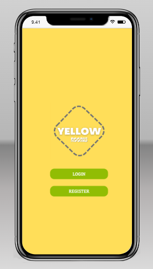
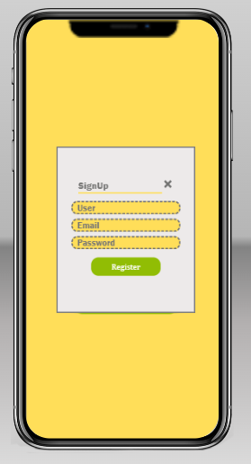
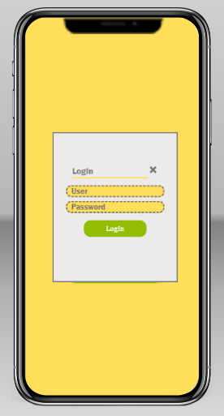
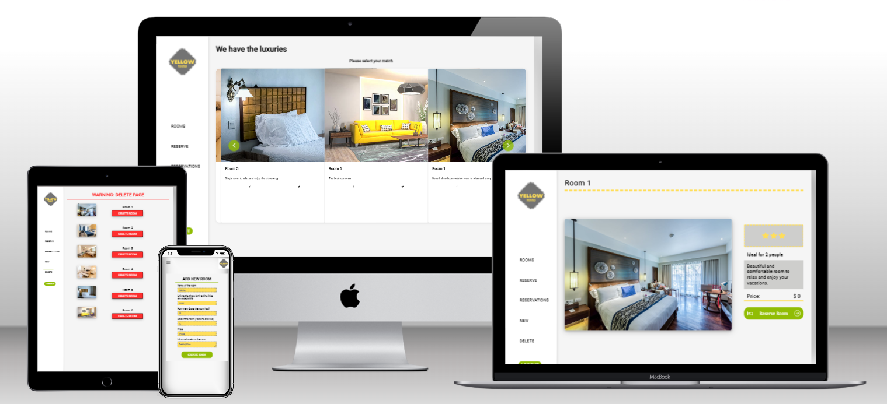

# Yellow Rooms

Yellow rooms has been created to book reservations for hotel rooms. On this repository, we created the front end of the project.

You can see the backend for this project [here](https://github.com/marurevi/YellowRooms-Back).

## Built With

- React
- Redux

## Live Demo & Screenshots

>[YELLOW ROOMS](https://yellow-rooms.netlify.app/)
<table>
<tr>
<td></td>
<td></td>
<td></td>
</tr>
</table>
<div align="center"></div>


## Getting Started

To get a local copy up and running follow these simple example steps.

### Prerequisites

- Any web browser (e.g. Google Chrome)
- Any Code Editor (e.g. Vscode)
- NodeJS

### Setup

- Create a new folder.

```bash
mkdir folder
```

- Move to the folder:

```bash
cd folder
```

- Clone the repo:

```bash
git clone https://github.com/marurevi/YellowRooms-Front.git
```

### Install

- Install the dependencies:

```
npm install
```

### Usage

- Start a live development server:

```
npm start
```

### Run tests

- Run tests:

```
npm test
```

## Authors

👤 **Andres Agudelo**

- GitHub: [@anagudelogu](https://github.com/anagudelogu)
- Twitter: [@AgudeloAndres\_\_](https://twitter.com/AgudeloAndres__)
- LinkedIn: [Andres Agudelo Guzman](https://linkedin.com/in/aagst)

👤 **Mariana Revilla Lérida**

- GitHub: [@marurevi](https://github.com/marurevi)
- Twitter: [@MaruRevilla](https://twitter.com/MaruRevilla)
- LinkedIn: [Mariana-Revilla-Lérida](https://linkedin.com/in/mariana-revilla-l%C3%A9rida-a12aba143)

👤 **Axel Soler**

- GitHub: [@AxelSoler](https://github.com/AxelSoler)
- LinkedIn: [Axel Soler](https://www.linkedin.com/in/axel-soler-685985232/)
- Twitter: [Axel Soler](https://twitter.com/AxelSoler18)

👤 **Tadesse Alemayehu**

- GitHub: [@Tadess-Alemayehu](https://github.com/Tadesse-Alemayehu)
- Twitter: [@TadesseWebDev](https://twitter.com/TadesseWebDev)
- LinkedIn: [Tadesse Alemayehu](https://www.linkedin.com/in/tadesse-alemayehu-60141a221/)

## 🤝 Contributing

Contributions, issues, and feature requests are welcome!

Feel free to check the [issues page](https://github.com/marurevi/YellowRooms-Front/issues).

## Show your support

Give a ⭐️ if you like this project!

## Acknowledgments

- Original design idea by: [Murat Korkmaz](https://www.behance.net/muratk)

## 📝 License

This project is [MIT](./LICENSE) licensed.
